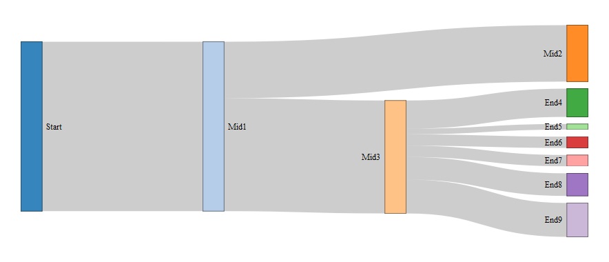
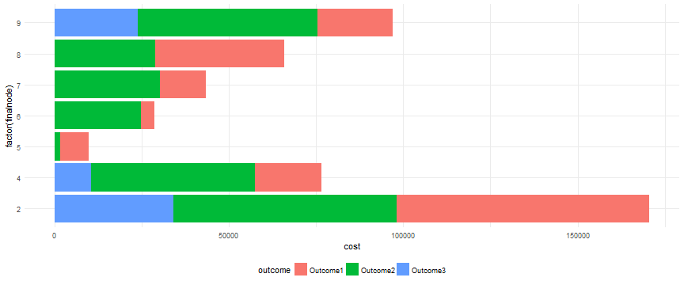

## The Assignment

This assignment consisted of two parts:

1. An **R Shiny** application, complete with input, reactive output, and associated documentation

2. A **Reproducible Pitch Presentation** in R Studio Presenter, complete with embedded R code

 
 
 
### The Links

1. The Shiny application: [link here](https://cwalsh.shinyapps.io/developing_data_products_dynamic_sankey_diagram/)

2. The Pitch Presentation: [link here](https://chwalsh.github.io/DataProductDeck)

---

## The Use Case

This application was designed to provide insight into the flow of observations through a complex, multi-step workflow. The inital tab provides a Sankey Diagram to help **visualize flow through the system**. The diagram is reactive, and as cases are filtered on their underlying characteristics (e.g. priority level, expected value) the Sankey will update as well. The second tab includes a reactive bar chart that provides **insight into case outcomes** (e.g. cost and revenue). 

This application is a proof of concept and all underyling data was simulated.

---

## The Sankey

The **Sankey Diagram** allows users to visualize the flow of cases between steps in the workflow based on the reactive filters applied. In the example above we can see how cases start from a common point but eventually diverge towards *Mid2* and *Mid3*.

---

## The Bar Chart

The **Bar Chart** allows users to understand the costs and revenues associated with the cases selected by the reactive filters. In the example above we can see the cases that end at *Node 2* (Mid2) resulted in the greatest cost to work. This is likely driven by their volume, which can be observed on the previous Sankey Diagram.
